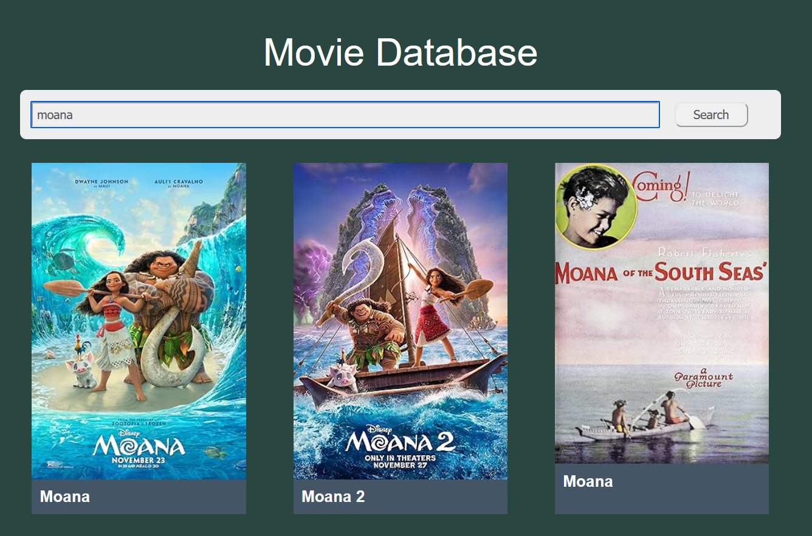

# Movie Database

This little project was made for study purposes.
Credit and thanks to Tyler Potts for the great tutorial on YouTube!
https://www.youtube.com/watch?v=ufodJVcpmps&ab_channel=TylerPotts

# How to run

In the project directory, run:

* npm start 

Runs the app in the development mode.
Open http://localhost:5173 to view it in the browser.

The page will reload if you make edits.

